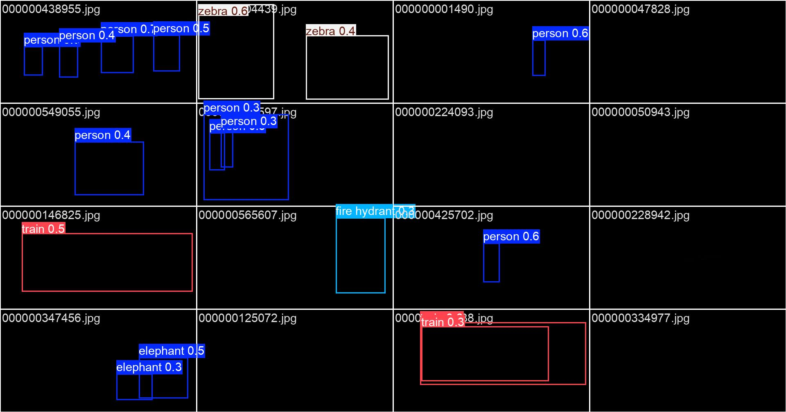
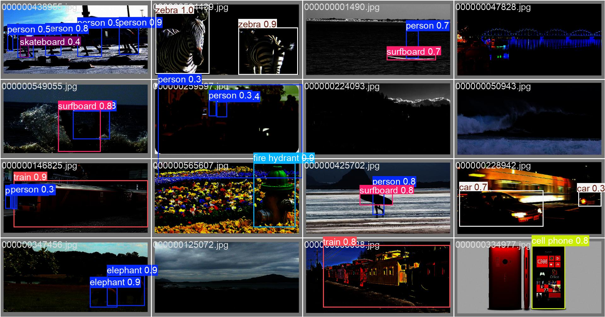
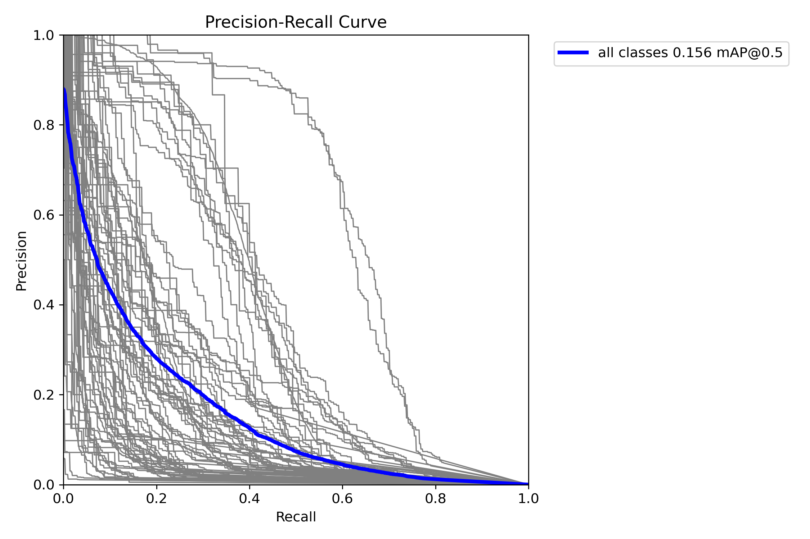
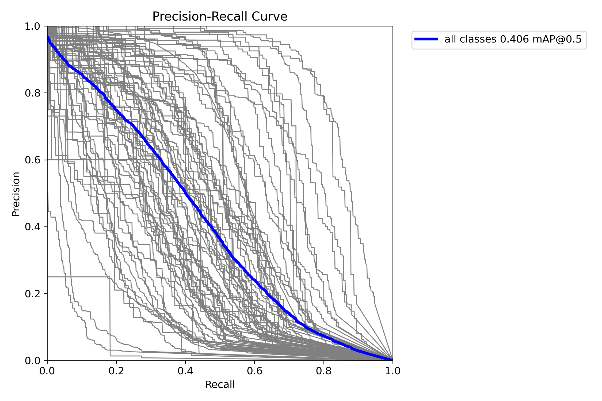

# **Low Light Object Detection**

## **Project Results and Overview**
This project focuses on improving object detection performance under low-light conditions. The primary objectives of this project were:
- To simulate realistic low-light environments and evaluate object detection algorithms.
- To enhance detection accuracy using two stage pipeline and model optimization techniques.

### **Key Results**
- Improved detection accuracy (mAP@0.5) by **0.25** in low-light conditions compared to non-enhanced object detection.
- Two-Stage training composed of low light enhancement training and object detection training

#### Validation Sample Comparison
- **YOLO without enhancement module**: Validation sample image for low-light object detection trained only with YOLO.
- **2-stage training**: Validation sample image trained with low-light enhancement module followed by object detection.


##### *YOLO without enhancement module*


##### *2-stage trained validation sample*

#### Motivation

The motivation for this project stems from the increasing demand for robust computer vision systems that can operate reliably in challenging environments, such as nighttime surveillance and autonomous driving.

---

## **Source Code**
The source code is organized as follows:

```
├── basicsr/
│   ├── data/                 # Datasets Classes
│   ├── metrics/              # Metrics for Enhancement
|   ├── models/               # RetinexFormer modules
|   ├── utils/                # RetinexFormer util files
|   ├── train.py              # Train RetinexFormer for low light enhancement
├── datasets/
│   ├── coco/                 # COCO Datasets (Further Details on Prepare Datasets section below)   
├── Enhancement/
│   ├── test_from_dataset.py  # RetinexFormer test file
├── Options/                  # Configurations for RetinexFormer COCO training
├── ultralytics/              # YOLO packages for LLOD training with pretrained enhancement module
├── json2yolo.py              # For converting json format labels to yolo format labels
├── train_yolo.py             # Training YOLO model for LLOD
├── requirements.txt          # Python dependencies
```

### **Setup Instructions**
To set up the project locally:
1. Create Conda Environment
   ```bash
   conda create -n {env_name} python=3.10
   conda activate {env_name}
   # for CUDA 12.4
   pip install torch==2.4.0 torchvision==0.19.0 torchaudio==2.4.0 --index-url https://download.pytorch.org/whl/cu124
   ```
2. Clone this repository:
   ```bash
   git clone https://github.com/myh4832/Low_Light_Object_Detection.git
   cd Low_Light_Object_Detection
   ```
3. Install dependencies:
   ```bash
   pip install -r requirements.txt
   ```
4. Install BasicSR
   ```bash
   python3 setup.py develop --no_cuda_ext
   ```
5. Install ultralytics (YOLO)
   ```bash
   pip install ultralytics
   ```

## **Prepare Dataset**

### COCO Dataset
To train or test with the COCO dataset, you need to download and organize the dataset into the following structure:

```
datasets/
└── coco/
    ├── annotations/
    │   ├── instances_train2017.json
    │   └── instances_val2017.json
    ├── images/
    │   ├── train/
    │   │   ├── 000000000001.jpg
    │   │   ├── 000000000002.jpg
    │   │   ├── ...
    │   ├── val/
    │   │   ├── 000000000001.jpg
    │   │   ├── 000000000002.jpg
    │   │   ├── ...
```

---

### Download the COCO Dataset
You can download the COCO dataset from the official [COCO website](https://cocodataset.org/#download).

### Required Files:
- **Annotations**:
  - `instances_train2017.json`
  - `instances_val2017.json`
  - Download these from the [COCO Annotations](https://cocodataset.org/#download).

- **Images**:
  - **Train Images**: `train2017.zip`
  - **Validation Images**: `val2017.zip`
  - Download these from the [COCO Images](https://cocodataset.org/#download).

---

### Generating YOLO format labels
To train YOLO object detection model, we need to convert the labels from json format to yolo format. You can convert these labels using the implemented `json2yolo.py`.
```bash
# Train Labels
python3 json2yolo.py --json_file ./datasets/coco/annotations/instances_train2017.json --img_dir ./datasets/coco/images/train/ --save_dir ./datasets/coco/labels/train/
# Val Labels
python3 json2yolo.py --json_file ./datasets/coco/annotations/instances_val2017.json --img_dir ./datasets/coco/images/val/ --save_dir ./datasets/coco/labels/val/
```

---

## **Performance Metrics**

### 1. Low Light Enhancement Model
This table presents the PSNR, SSIM, FLOPS (G), and PARAM (M) values for the Low Light Enhancement model.

| Metric            | Value            |
|-------------------|------------------|
| **PSNR**          | 25.62 dB         |
| **SSIM**          | 0.8154           |
| **FLOPS (G)**     | 15.57 G          |
| **PARAM (M)**     | 1.61 M           |

---

### 2. YOLO with and without Enhancement Module
This table compares mAP@0.5, mAP@0.5-0.95, PARAM (M), and GFLOPS (G) for YOLO models with and without the enhancement module.

| Model                  | mAP@0.5 | mAP@0.5-0.95 | PARAM (M) | GFLOPS (G) |
|------------------------|---------|--------------|-----------|------------|
| **YOLO (No Enhancement)** |  0.156  | 0.0912        | 20.09 M    | 68 G    |
| **YOLO (With Enhancement)** | 0.406   |  0.275      | 21.7 M    | 84 G    |

### **Performance Graphs**


##### *PR Curve (No Enhancement)*

##### *PR Curve (With Enhancement)*

---

## **Training**
1. To train the low light enhancement model(RetinexFormer):
```bash
python3 basicsr/train.py --opt Options/RetinexFormer_COCO.yml
```

2. To train the object detection model with the frozen pretrained low light enhancement model(YOLO):
```bash
python3 train_yolo.py
```
(Note) You can select any yolo model(i.e., yolo11n.pt, yolo11s.pt, ...) in `train_yolo.py`. I trained 'yolo11m.pt' for all evaluation results.
(Note) You have to change the input parameter **model_restoration** and **model_restoration_path** to **None**, if you have not pretrained the low light enhancement model.

---

## **Validation**
1. To validate low light enhancement model (RetinexFormer):
```bash
python3 Enhancement/test_from_dataset.py --opt Options/RetinexFormer_COCO.yml --weights {pretrained_model_path} --dataset COCO
```

2. To validate YOLO model:
```bash
python3 validate_yolo.py
```
(Note) Same with training, you have to change the input parameters.

## **References and Documentation**
### **References**
- [YOLOv11 Official Repository](https://github.com/ultralytics/ultralytics)
- Papers:
  - "Retinexformer: One-stage Retinex-based Transformer for Low-light Image Enhancement" (https://openaccess.thecvf.com/content/ICCV2023/papers/Cai_Retinexformer_One-stage_Retinex-based_Transformer_for_Low-light_Image_Enhancement_ICCV_2023_paper.pdf)

### **Documentation**
- Low light simulation algorithms:
  - **Gamma Correction** and **Gaussian noise** for simulating low-light conditions.
  - **Data Augmentation** using rotation and horizontal flip.
- Optimization:
  - **AdamW** for optimizing whole stage training.
---

## **Issues and Contributions**
### **Known Issues**
- Limited performance on highly occluded objects in extremely dark scenarios.
- Inference speed decreases with larger input image sizes and two-stage pipeline.

## **Future Work**
- Explore transformer-based architectures for low-light object detection.
- Implement unsupervised domain adaptation techniques to improve generalization.
- Integrate additional datasets for further testing and validation.